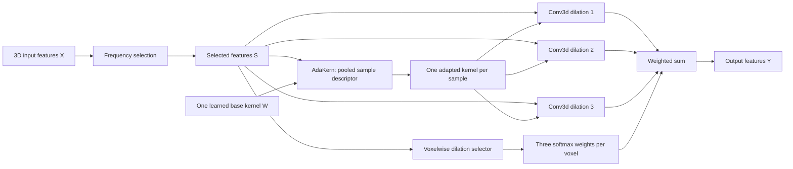

# Understanding our 3D FADC implementation, from the beginning

This guide explains the implementation in `fadc_av`, for a student who is
new to convolution, frequency analysis and adaptive neural networks. Read it
in order the first time. Every equation is followed by its meaning, and the
file map near the end connects the ideas to executable code.

Our task is breast tumour segmentation from pre-contrast and post-contrast MRI.
Our model is a **fully 3D U-Net containing a discrete 3D adaptation of FADC**.
FADC means **Frequency-Adaptive Dilated Convolution**. It changes how a layer
processes features; it is not a complete segmentation network by itself.

The starting research is Chen et al., *Frequency-Adaptive Dilated Convolution
for Semantic Segmentation*, CVPR 2024. The original paper introduces frequency
selection, adaptive kernels and spatially adaptive dilation. Our fixed-dilation
branch mixture is a project-specific adaptation, not an exact implementation
of the original continuous sampling mechanism. Equations below describe **our
code** unless explicitly identified as background.

## Reading map

1. [Volumes, channels and segmentation](#1-volumes-channels-and-segmentation)
2. [Convolution and dilation](#2-convolution-and-dilation)
3. [The complete flow](#3-the-complete-flow)
4. [Frequency and the Fourier transform](#4-frequency-and-the-fourier-transform)
5. [Frequency decomposition, start to finish](#5-frequency-decomposition-start-to-finish)
6. [Learning which frequency components to emphasize](#6-learning-which-frequency-components-to-emphasize)
7. [AdaKern: adapting the convolution kernel](#7-adakern-adapting-the-convolution-kernel)
8. [Voxelwise dilation mixing](#8-voxelwise-dilation-mixing)
9. [An entire forward pass with shapes](#9-an-entire-forward-pass-with-shapes)
10. [How the U-Net uses FADC](#10-how-the-u-net-uses-fadc)
11. [How learning connects everything](#11-how-learning-connects-everything)
12. [Training, validation and checkpoints](#12-training-validation-and-checkpoints)
13. [Correctness, limitations and experiments](#13-correctness-limitations-and-experiments)
14. [Code map and examples](#14-code-map-and-examples)
15. [Glossary and self-check](#15-glossary-and-self-check)

## 1. Volumes, channels and segmentation

A photograph is usually a grid of pixels. An MRI volume is a three-dimensional
grid of **voxels**. A voxel has a position along three spatial axes and an
intensity value. Segmentation assigns a class to each voxel: background or tumour.

The model receives a tensor, which is simply a multidimensional array:

$$X \in \mathbb{R}^{B\times C\times D\times H\times W}.$$

| Symbol | Meaning | Example at the input |
|---|---|---|
| $B$ | Number of samples in a batch | 2 |
| $C$ | Channels, or feature maps per sample | 2 MRI phases |
| $D,H,W$ | Three spatial dimensions | 128, 128, 64 |
| $\mathbb{R}$ | Real-valued numbers | Floating-point intensities |

Thus an input batch can have shape `(2, 2, 128, 128, 64)`. The first 2 counts
samples; the second 2 counts pre-contrast and post-contrast channels. They are
different things. These spatial letters are tensor conventions: they do not
by themselves establish which axis is anatomical left-right or superior-inferior.
That depends on preprocessing and image orientation.

After the first convolution, the channels are **learned features**, not MRI
phases. A channel might respond to some useful intensity, texture or structural
pattern. We should not assume that a particular channel has a fixed human label.

The final output has shape `(B, 2, D, H, W)`. Its two channels contain **logits**:
unrestricted scores for background and tumour. A softmax converts these scores
to probabilities. Taking the larger score at each voxel gives the predicted mask.

The ground-truth mask, supplied during supervised training, has shape
`(B, 1, D, H, W)` with values 0 or 1. It is used to compute the loss; it is not
fed into the FADC gates when predicting a new scan.

## 2. Convolution and dilation

### 2.1 What a convolution does

A convolution moves a small set of learned weights over a feature volume.
At each location it multiplies neighboring feature values by those weights,
adds the results, and produces a new feature value.

A `3×3×3` kernel has 27 spatial positions **for each input/output channel pair**.
If there are $I$ input channels and $O$ output channels, its tensor is:

$$W \in \mathbb{R}^{O\times I\times3\times3\times3}.$$

It therefore has $27OI$ weights, not just 27 weights for the entire layer.
For example, a 128-to-128 convolution has $27\times128\times128=442,368$
base-kernel weights. Attention networks add their own parameters.

Write a spatial location as $p$ and a kernel offset as
$q\in\{-1,0,1\}^3$. A stride-one convolution with dilation $r$ is:

$$Y_o(p)=\sum_{i=1}^{I}\sum_q W_{o,i}(q)X_i(p+r q).$$

Here $i$ selects an input channel, $o$ selects an output channel, and each
sum means "add the contributions." Batch indices are omitted for readability.
Technically PyTorch's `Conv3d` computes cross-correlation, without flipping
the kernel; neural-network practice calls this convolution.

### 2.2 Dilation changes spacing, not the number of weights

In a one-dimensional illustration, a three-position kernel samples:

```text
dilation 1: positions -1, 0, +1
dilation 2: positions -2, 0, +2
dilation 3: positions -3, 0, +3
```

The same principle applies on all three axes. For kernel size $K$ and dilation $r$:

$$K_{\mathrm{effective}}=1+(K-1)r.$$

With $K=3$, the spatial extent is 3, 5 or 7:

| Dilation | Bounding extent in 3D | Spatial samples per channel pair |
|---|---|---|
| 1 | `3×3×3` | 27 |
| 2 | `5×5×5` | 27 |
| 3 | `7×7×7` | 27 |

A dilated `3×3×3` kernel does not become a dense `7×7×7` kernel. It samples
sparsely over that larger extent. This can provide broader context but can
also miss intermediate detail. These extents describe this layer alone;
earlier layers also contribute to the network's receptive field.

### 2.3 Padding preserves shape

For one spatial dimension, convolution output length is:

$$N_{\mathrm{out}}=\left\lfloor\frac{N+2P-r(K-1)-1}{s}+1\right\rfloor.$$

$N$ is input length, $P$ is padding and $s$ is stride. Our adaptive convolutions
use $K=3$, $s=1$ and $P=r$, so $N_{\mathrm{out}}=N$. All three branches can
therefore be mixed voxel by voxel. The padding is zero padding.

### 2.4 Why adapt anything?

A fixed convolution uses the same learned weights and sampling spacing for
every input. Different regions may benefit from different amounts of local
detail and wider context. Our FADC adaptation provides three connected controls:

| Component | Question it helps the network answer |
|---|---|
| Frequency selection | Which feature scales should be emphasized here? |
| AdaKern | How should this sample modify the shared kernel's mean and variation? |
| Dilation mixing | How much should this voxel use each available sampling spacing? |

These controls are learned from segmentation loss. They are not manually coded
rules saying "a tumour must use dilation 1" or "noise must be removed."

## 3. The complete flow

Read the diagram from left to right. The output of frequency selection feeds
**both** attention networks and the convolution branches.



In symbols:

$$S=\operatorname{FreqSelect}(X),\qquad W_b^*=\operatorname{AdaKern}(S_b,W),$$
$$A=\operatorname{Softmax}(\operatorname{DilationHead}(S)/T),$$
$$Y_b(p)=\sum_{r\in\{1,2,3\}} A_{b,r}(p)\,
\operatorname{Conv3D}_{r}(S_b;W_b^*)(p).$$

$b$ selects a sample, $p$ selects a voxel, $T$ is temperature, $A$ contains
mixing weights, and $W_b^*$ is the adapted kernel. The following sections
unpack every operation in these equations.

## 4. Frequency and the Fourier transform

### 4.1 Spatial frequency is how quickly values change across space

Imagine reading feature values along a line through a volume:

```text
Constant:       5, 5, 5, 5, 5, 5, ...
Slow variation: a broad smooth rise and fall
Fast variation: 1, 0, 1, 0, 1, 0, ...
```

The constant sequence has only zero frequency. A slowly varying pattern has
low spatial frequencies; rapidly alternating values contain high frequencies.
Frequency here is **not MRI acquisition frequency, time, or the order of scans**.
We analyze how a feature map varies over its spatial grid.

Edges, fine texture and noise can all contribute high frequencies. Broad
structure can contribute low frequencies. No frequency component exclusively
represents tumour, and a tumour can contain useful information at several scales.

### 4.2 The FFT changes representation

The Fourier transform expresses a volume as a combination of spatial waves.
The FFT is an efficient algorithm for computing that transform. It does not
learn a filter or identify a tumour.

For one channel, the orthonormal 3D discrete transform can be written:

$$\widehat X[a,b,c]=\frac{1}{\sqrt{DHW}}
\sum_{z=0}^{D-1}\sum_{y=0}^{H-1}\sum_{x=0}^{W-1}
X[z,y,x]e^{-2\pi\mathrm{i}(az/D+by/H+cx/W)}.$$

$z,y,x$ index spatial positions; $a,b,c$ index frequency bins; $\mathrm{i}$ is
the imaginary unit, satisfying $\mathrm{i}^2=-1$. Each complex coefficient
encodes the strength and phase of a wave. Phase describes its alignment.
The factor $1/\sqrt{DHW}$ matches `norm="ortho"` in our FFT and inverse FFT.

You do not need to calculate this sum manually. The key relation is:

$$\widehat X=\mathcal F(X),\qquad X=\mathcal F^{-1}(\widehat X).$$

The hat denotes frequency representation. Our code transforms only the final
three axes, separately for every sample and channel. It does not Fourier
transform the batch axis or mix MRI channels in the FFT.

### 4.3 Frequency bins, DC and negative frequencies

For length 8, `torch.fft.fftfreq(8)` gives:

```text
0, 1/8, 2/8, 3/8, -4/8, -3/8, -2/8, -1/8
```

Units are cycles per feature voxel. Zero is called **DC** and carries the
constant component. The maximum representable frequency magnitude is one-half
cycle per voxel for an even-sized axis, the Nyquist limit.

Negative frequencies do not mean negative intensities. They arise from the
complex-wave representation. Real inputs have conjugate symmetry:

$$\widehat X(-\mathbf f)=\overline{\widehat X(\mathbf f)}.$$

The bar means complex conjugate. In 3D, $\mathbf f=(f_z,f_y,f_x)$, so its
partner is $(-f_z,-f_y,-f_x)$, with indices understood modulo the grid sizes.
Keeping or removing both consistently preserves a real inverse transform.

Our masks are symmetric. We take `.real` after inverse FFT to remove numerical
roundoff, not to conceal a deliberately asymmetric filter.

## 5. Frequency decomposition, start to finish

Implemented in [frequency.py](frequency.py).

### 5.1 Build three nested low-pass masks

A mask is an array of zeros and ones in **frequency space**. One means keep
that Fourier coefficient, and zero means remove it. It is not a tumour mask.

For a cutoff denominator $k$, our mask is:

$$M_k(\mathbf f)=
\begin{cases}
1,& |f_z|<1/(2k),\ |f_y|<1/(2k),\ |f_x|<1/(2k),\\
0,&\text{otherwise}.
\end{cases}$$

All three conditions must hold. This creates a centered **cuboid**, not a
sphere. Equivalently, define $\rho=\max(|f_z|,|f_y|,|f_x|)$ and keep
$\rho<1/(2k)$. The strict inequality means a bin exactly at the cutoff goes
to the next higher band.

The default `cutoffs=(2,4,8)` gives thresholds $1/4$, $1/8$ and $1/16$.
Larger $k$ means a narrower retained low-frequency region. It is unrelated
to the `3×3×3` convolution kernel size.

### 5.2 Filter the same FFT three ways

Compute the input FFT once. For each mask:

$$L_k=\mathcal F^{-1}(M_k\odot\widehat X).$$

$\odot$ means elementwise multiplication. $L_k$ is back in spatial coordinates
and has the same shape as $X$. It contains only frequencies passed by $M_k$.
The low-pass volumes are progressively smoother in the frequency-filtering
sense; sharp cutoffs can also introduce ringing, discussed later.

The code uses unshifted FFT coordinates consistently, so no `fftshift` or
`ifftshift` is needed. Shifting is an indexing convention, not an essential
part of frequency filtering.

### 5.3 Subtract nested low-pass volumes to obtain four components

$$B_1=X-L_2,\quad B_2=L_2-L_4,\quad B_3=L_4-L_8,\quad B_4=L_8.$$

| Component | Frequency region using $\rho$ | Interpretation |
|---|---|---|
| $B_1$ | $1/4\le\rho\le1/2$ on available bins | Fastest variations |
| $B_2$ | $1/8\le\rho<1/4$ | Intermediate variations |
| $B_3$ | $1/16\le\rho<1/8$ | Slower variations |
| $B_4$ | $0\le\rho<1/16$ | Lowest-frequency residual, including DC |

The three difference components are called `high` in the return value. That
means higher than the final low residual; it does not mean they all have the
same frequency range. `low` is $B_4$.

Every component is a full-size spatial feature tensor. We have not divided the
volume into spatial regions or split its channels into four groups.

### 5.4 Why the components reconstruct the input

$$B_1+B_2+B_3+B_4
=(X-L_2)+(L_2-L_4)+(L_4-L_8)+L_8=X.$$

The intermediate terms cancel. This is a **telescoping sum**. Decomposition
alone preserves the input, apart from floating-point error. Learned reweighting
in the next section changes its contributions.

Reconstruction is necessary but not a sufficient test of correct masks: the
same cancellation can happen with badly chosen low-pass masks.

### 5.5 A concrete length-16 example

Consider a cosine that varies only along an axis of length 16. A bin number
$j$ corresponds to frequency $j/16$ cycles per voxel.

| Pattern | Frequency | Component |
|---|---|---|
| Constant | 0 | $B_4$ |
| One cycle across 16 voxels | $1/16$ | $B_3$ |
| Two cycles | $1/8$ | $B_2$ |
| Four cycles | $1/4$ | $B_1$ |

This example also illustrates strict cutoff boundaries. For a pattern varying
along several axes, use the maximum absolute axis frequency, not their sum.

### 5.6 Small volumes and duplicate masks

A small grid cannot represent arbitrarily fine frequency divisions. At shape
`(8,8,4)`, both the $k=4$ and $k=8$ masks contain only DC. Consequently,
$L_4=L_8$ and $B_3=0$ for every input of this shape.

Our code marks this component inactive, returns an explicit zero band, and
does not run its gate. The module still owns the same registered parameters;
it does not create new parameters during forward passes. `active` describes
available frequency support, not whether a specific scan has energy in a band.

The old rounded-slice construction could instead create an empty low-pass
mask. For dimension 8 and $k=8$, its endpoints were `round(3.5)` and
`round(4.5)`, both 4 under Python's tie-to-even rounding. Slice `4:4` is empty.
Our coordinate-based masks always include zero, so DC cannot disappear this way.

### 5.7 Why four bands in 3D?

The original paper used four octave-like frequency ranges in 2D. We extend
the mask to a third frequency axis and retain those thresholds. More spatial
dimensions do not automatically require more bands.

Two components, $X-L_2$ and $L_2$, also reconstruct a 3D input. They offer less
independent control over intermediate scales. Four is our current experiment
setting, not a proven optimum for breast tumour segmentation.

## 6. Learning which frequency components to emphasize

Implemented in [selection.py](selection.py).

### 6.1 Predict a spatial gate for each active difference band

For each band $j\in\{1,2,3\}$, a separate `Conv3d` predicts logits:

$$Z_j=\operatorname{Conv3D}_j(X),\qquad G_j=2\sigma(Z_j),$$
$$\sigma(z)=\frac{1}{1+e^{-z}}.$$

$G_j$ is a **gain map**. Each gate sees the original input features $X$, not
only its isolated band and not the ground-truth segmentation mask. Its
`3×3×3` convolution can use local feature context to choose a gain.

For finite real logits, gains lie between 0 and 2:

| Gain | Effect on that band's contribution |
|---|---|
| Near 0 | Strong suppression |
| 0.5 | Halve it |
| 1 | Preserve it |
| 1.5 | Amplify it |
| Near 2 | Nearly double it |

Band values can be negative; a positive gain scales their magnitude without
reversing their sign. Floating-point saturation can reach the range endpoints.

These are independent sigmoid gates. They **do not sum to one** across bands.
That differs from the softmax probabilities used for dilation mixing.

### 6.2 Grouped gates and broadcasting

With `spatial_groups=1`, each gain has shape `(B,1,D,H,W)`. At a particular
voxel, all input channels share that band's gain. The gain can still vary
between voxels and between samples.

If groups $G>1$ are requested, $G$ must divide the number of channels.
Each gain has shape `(B,G,D,H,W)`, and each contiguous group of $C/G$ channels
shares a gain. Grouped gate convolutions read their own channel groups.
Our experiment models use $G=1$.

**Broadcasting** means applying a smaller tensor over a matching larger one:
the singleton channel dimension is reused rather than explicitly copied.

### 6.3 Recombine the weighted features

By default, the lowest-frequency residual is not gated:

$$S=B_4+G_1\odot B_1+G_2\odot B_2+G_3\odot B_3.$$

The optional `low_frequency_attention=True` adds a fourth learned gain:
$G_4\odot B_4$. It is **off in our two experiment models**.

Keeping $B_4$ untouched preserves that direct low-frequency path. It does not
mean the entire network preserves mean intensity: later convolutions and
nonlinearities can change it. Spatially varying multiplication can also mix
frequencies, so the final selected features need not retain disjoint bands.

### 6.4 Initialization and a numerical example

Each frequency-gate convolution starts with zero weights and zero bias.
Therefore $Z_j=0$, $\sigma(0)=0.5$, and $G_j=1$. Initially:

$$S=B_1+B_2+B_3+B_4=X.$$

For an illustrative voxel/channel, suppose the four component values are
$2,-1,0.5,4$. Their sum is 5.5. If their three learned gains are $0.5,1.5,1$:

$$S=4+(0.5)(2)+(1.5)(-1)+(1)(0.5)=4.$$

This calculation occurs at every voxel and channel with the appropriate gates.
The chosen numbers illustrate arithmetic; they are not measured tumour features.

### 6.5 Connection to the next components

The result $S$ feeds the dilation selector, AdaKern descriptor and convolution
branches. Changing a frequency gate therefore changes both the signal being
convolved and the information used to predict the adaptive behavior.

The code never explicitly computes a local frequency label and commands a
particular dilation. Any useful relationship emerges through learning.

## 7. AdaKern: adapting the convolution kernel

Implemented in [adakern.py](adakern.py). The base kernel is owned by
`SharedKernelConv3D` in [dilation.py](dilation.py).

### 7.1 Two meanings of low and high must be separated

Frequency selection splits **feature volumes** into four spectral components.
AdaKern splits **kernel weights** into two components: their spatial mean and
their zero-mean variation. These are related frequency ideas, but different
tensors and different decompositions. AdaKern does not perform a second FFT
of the feature volume, and it does not use four kernel bands.

### 7.2 Split each input/output kernel into mean and residual

For each output channel $o$ and input channel $i$:

$$\mu_{o,i}=\frac{1}{27}\sum_q W_{o,i}(q),$$
$$W^L_{o,i}(q)=\mu_{o,i},\qquad W^H_{o,i}(q)=W_{o,i}(q)-\mu_{o,i}.$$

The mean is broadcast to all 27 positions. Consequently:

$$W=W^L+W^H,\qquad\sum_q W^H_{o,i}(q)=0.$$

The constant spatial component corresponds to DC in the kernel's discrete
Fourier representation. The residual contains non-DC variation; calling it
"high" does not make it a sharply bounded high-pass spectral band like $B_1$.

For a tiny one-dimensional analogy, weights `[1,2,3]` have mean 2:

```text
mean component:     [ 2, 2, 2]
residual component: [-1, 0, 1]
sum:                [ 1, 2, 3]
```

### 7.3 Build one descriptor per sample

AdaKern globally averages the selected features:

$$v_{b,i}=\frac{1}{DHW}\sum_p S_{b,i}(p).$$

This gives shape `(B,I)`. It summarizes each channel over space. A linear
layer and ReLU produce a descriptor with 16 hidden values per sample:

$$h_b=\operatorname{ReLU}(A v_b+a).$$

$A$ and $a$ are learned weights and bias. ReLU means $\max(0,x)$ elementwise.
This descriptor is global; it does not retain a separate value at every voxel.

### 7.4 Predict four gain vectors

Four independent linear heads followed by $2\sigma$ predict:

| Gain vector | Code name | Shape | Role |
|---|---|---|---|
| $l^{in}$ | `low_input` | `(B,I)` | Input-channel gain for kernel mean |
| $l^{out}$ | `low_output` | `(B,O)` | Output-filter gain for kernel mean |
| $h^{in}$ | `high_input` | `(B,I)` | Input-channel gain for kernel residual |
| $h^{out}$ | `high_output` | `(B,O)` | Output-filter gain for kernel residual |

These gains depend on $S_b$. Their prediction heads are learned across the
dataset, but their output values change with the sample presented to the model.

### 7.5 Form the adapted kernel

$$W^*_{b,o,i}(q)=
l^{out}_{b,o}l^{in}_{b,i}W^L_{o,i}(q)
+h^{out}_{b,o}h^{in}_{b,i}W^H_{o,i}(q).$$

For each input/output channel pair, multiply its low component by the product
of two low gains and its high component by the product of two high gains.
Then add them. Each individual gain is between 0 and 2; each product can
approach 4. There is no learned gain for each of the 27 kernel positions in
our current AdaKern implementation.

Using the `[1,2,3]` analogy, low product 0.5 and high product 1.5 yield:

$$0.5[2,2,2]+1.5[-1,0,1]=[-0.5,1,2.5].$$

The kernel changes its balance between constant and varying spatial weights.
AdaKern cannot independently invent an arbitrary new 27-position kernel for
each sample; its adaptation is constrained by the learned base mean/residual.

### 7.6 What is shared, and what is sample-specific?

The model stores one trainable base kernel $W$ per adaptive convolution.
AdaKern constructs a temporary tensor of shape `(B,O,I,3,3,3)` each forward
pass. That tensor depends on the current samples and carries gradients, but
is not a new independently learned parameter registered on every call.

Within a sample, $W_b^*$ is shared across spatial positions and all three
dilation branches. Different samples can have different adapted kernels.
Different FADC layers have their own base kernels; sharing is **within a layer**,
not across all eight encoder convolutions.

### 7.7 Why the batched grouped convolution is correct

PyTorch's ordinary `Conv3d` uses the same kernel across a batch. To apply
different kernels per sample efficiently, the implementation reshapes:

```text
features: (B,I,D,H,W)     -> (1,B*I,D,H,W)
weights:  (B,O,I,3,3,3)   -> (B*O,I,3,3,3)
conv3d(..., groups=B)
result:   (1,B*O,D,H,W)   -> (B,O,D,H,W)
```

Each group receives only one sample's input channels and kernel. Patients
are not mixed. This implementation trick differs from `spatial_groups` in
frequency selection. The underlying per-sample convolution still has groups 1.

### 7.8 Initialization

The four output heads start at zero logits, so all four gain vectors start
at one. Thus $W_b^*=W^L+W^H=W$. AdaKern initially preserves the base kernel.
It remains enabled and can begin adapting as its heads learn.

## 8. Voxelwise dilation mixing

Implemented in `VoxelwiseDilationSelector` and `AdaptiveDilatedConv3D` in
[dilation.py](dilation.py).

### 8.1 Predict three scores at each voxel

Selected features $S$ pass through:

```text
Conv3d(I -> 16, kernel 3) -> ReLU -> Conv3d(16 -> 3, kernel 1)
```

The result $Z$ has shape `(B,3,D,H,W)`. Its three channels are scores for
dilations 1, 2 and 3. The selector is spatial: different voxels can have
different scores. It is not the globally pooled AdaKern descriptor.

### 8.2 Softmax and temperature

$$A_{b,r}(p)=\frac{\exp(Z_{b,r}(p)/T)}
{\sum_{s\in\{1,2,3\}}\exp(Z_{b,s}(p)/T)}.$$

Softmax turns scores into positive weights whose sum over branches is one.
Temperature $T>0$ controls how concentrated they are: for fixed unequal scores,
smaller $T$ sharpens the distribution and larger $T$ flattens it.

Both current experiments use fixed $T=1$. Temperature is a registered buffer
saved in `state_dict`. It is not a trainable parameter in this implementation.

### 8.3 Apply the same adapted kernel at three spacings

$$Y^{(r)}_b=\operatorname{Conv3D}(S_b,W_b^*;\ \text{dilation}=r,\ \text{padding}=r).$$

Each branch has shape `(B,O,D,H,W)`. Then:

$$Y_{b,o}(p)=\sum_{r\in\{1,2,3\}}A_{b,r}(p)Y^{(r)}_{b,o}(p).$$

A voxel's three weights are shared across output channels. All three branch
outputs are computed: this is soft mixing, not hard selection that executes
only the most likely branch.

If a voxel has branch values `[2,4,8]` in one output channel and probabilities
`[0.6,0.3,0.1]`, the result is $0.6(2)+0.3(4)+0.1(8)=3.2$.

### 8.4 Expected dilation is a diagnostic, not a fourth convolution

$$\bar r_b(p)=1A_{b,1}(p)+2A_{b,2}(p)+3A_{b,3}(p).$$

In the example, $\bar r=1.5$. This summarizes the mixture. It does **not** mean
that the code sampled at dilation 1.5. In general:

$$\sum_r A_r\operatorname{Conv}_r(S,W^*)\ne
\operatorname{Conv}_{\sum_r A_r r}(S,W^*).$$

Sampling at fractional positions would require a specified interpolation or
sampling operator. Our branch mixture is why we call this a **discrete 3D
adaptation**, rather than an exact port of the paper's adaptive dilation.

### 8.5 Initialization is not an ordinary convolution

The selector's final head starts with zero weights and bias. All logits are
zero, so $A_1=A_2=A_3=1/3$. Initially the result is:

$$Y=\tfrac13(Y^{(1)}+Y^{(2)}+Y^{(3)}).$$

Frequency selection initially preserves $X$, and AdaKern initially preserves
$W$, but the entire adaptive convolution is **not** identical to dilation-1
convolution. It begins as an average of three dilations.

Also, `argmax` of `[1/3,1/3,1/3]` chooses the first index. A plot reporting
"100% dilation 1" from argmax alone can therefore misrepresent uniform initial
attention. Inspect the actual probabilities or entropy, not only argmax.

## 9. An entire forward pass with shapes

At encoder 3's second convolution, our standard patch and width give:

| Step | Tensor shape |
|---|---|
| Input features $X$ | `(2,128,32,32,16)` |
| FFT $\widehat X$ | `(2,128,32,32,16)`, complex |
| Each low-pass mask | `(1,1,32,32,16)` |
| Each of four spatial bands | `(2,128,32,32,16)` |
| Each high-band gain, groups 1 | `(2,1,32,32,16)` |
| Selected features $S$ | `(2,128,32,32,16)` |
| AdaKern pooled descriptor | `(2,128)` |
| AdaKern hidden descriptor | `(2,16)` |
| Each input/output gain vector | `(2,128)` here, because $I=O=128$ |
| Learned base kernel | `(128,128,3,3,3)` |
| Adapted per-sample kernels | `(2,128,128,3,3,3)` |
| Dilation probabilities | `(2,3,32,32,16)` |
| Each dilation branch output | `(2,128,32,32,16)` |
| Final mixed features | `(2,128,32,32,16)` |
| Expected dilation diagnostic | `(2,32,32,16)` |

The operator returns features, not a segmentation mask. The surrounding U-Net
block applies BatchNorm and ReLU, and the rest of the network continues processing.

The code accumulates weighted branches into an output rather than making an
extra stack of all three branches. This avoids that additional allocation;
backpropagation still retains intermediate tensors, so it is not constant-memory
training. Frequency components and gates also occupy memory.

## 10. How the U-Net uses FADC

### 10.1 Encoder, bottleneck and decoder

The encoder reduces spatial resolution and increases channels. The decoder
upsamples features to the original resolution. Encoder-to-decoder skip
connections concatenate features at matching scales to help recover detail.

For width 32 and input spatial shape `128×128×64`:

| Location | Feature channels before that stage's pooling | Spatial shape |
|---|---|---|
| Input | 2 | `128×128×64` |
| Encoder 1 | 32 | `128×128×64` |
| Encoder 2 | 64 | `64×64×32` |
| Encoder 3 | 128 | `32×32×16` |
| Encoder 4 | 256 | `16×16×8` |
| Bottleneck | 512 | `8×8×4` |
| Decoder 4 | 256 | `16×16×8` |
| Decoder 3 | 128 | `32×32×16` |
| Decoder 2 | 64 | `64×64×32` |
| Decoder 1 | 32 | `128×128×64` |
| Segmentation head | 2 logits | `128×128×64` |

Each encoder block has two convolutions followed by `MaxPool3d(2)`. The skip
is taken before pooling. Decoder stages use `ConvTranspose3d` to upsample,
concatenate the encoder skip, then apply two convolutions. A `1×1×1` head
maps the final 32 channels to two class logits. Odd dimensions are handled
by interpolation to the skip's shape in the decoder.

### 10.2 Our two placement experiments

| Variant | Encoder changes | Adaptive convolution count |
|---|---|---|
| `baseline` | None | 0 |
| `fadc_enc3` | Replace only encoder 3's second convolution | 1 |
| `fadc_all_encoders` | Replace both convolutions in encoders 1–4 | 8 |

Both FADC variants keep all three mechanisms enabled. "Full FADC" describes
the mechanisms; "all encoders" describes placement. They are different concepts.
The bottleneck and decoder remain ordinary convolution blocks in both variants.

The normal block is `Conv3d -> BN -> ReLU -> Conv3d -> BN -> ReLU`. We replace
selected convolution modules while retaining the surrounding operations. We
do not add residual block connections, dropout, or deep supervision.

The U-Net's long concatenation skips are different from a residual block's
short addition, $F(X)+X$. Our earlier corrected encoder-wide implementation
added residual connections and dropout around its adaptive convolutions;
the current placement experiments do not.

### 10.3 Why start at encoder 3?

It offers an intermediate resolution and avoids the largest early feature
maps. That makes it a manageable initial integration, not a proven best stage.
The eight-FADC model tests whether wider placement improves results enough
to justify its additional computation. All three branches execute at each
adaptive layer, so eight adaptive layers can be substantially more expensive.

### 10.4 What makes this genuinely volumetric?

FFT masks, convolution kernels, dilation, attention maps, pooling and
upsampling all operate in three spatial dimensions. We do not process each
slice independently with a 2D model. Two MRI channels describe two input
measurements, not the number of spatial dimensions.

## 11. How learning connects everything

### 11.1 The segmentation loss supervises all mechanisms

After the U-Net produces logits $z$, tumour probabilities are:

$$p_v=\frac{e^{z_{v,1}}}{e^{z_{v,0}}+e^{z_{v,1}}}.$$

$v$ indexes a voxel, and $y_v\in\{0,1\}$ is its ground-truth label.
Our batch Dice loss is:

$$L_{Dice}=1-\frac{2\sum_v p_v y_v+\epsilon}
{\sum_v p_v+\sum_v y_v+\epsilon},\qquad\epsilon=10^{-5}.$$

The sums include all voxels across the physical batch. Cross-entropy is:

$$L_{CE}=-\frac1N\sum_v[y_v\log p_v+(1-y_v)\log(1-p_v)].$$

The code uses PyTorch's numerically stable logits-based cross-entropy rather
than directly computing these logarithms. The combined loss is:

$$L=0.5L_{Dice}+0.5L_{CE}.$$

Dice encourages overlap of predicted foreground with ground truth. Cross-entropy
penalizes voxel classification errors. Neither term directly prescribes a band,
dilation, or AdaKern gain.

### 11.2 Backpropagation follows every connection

Backpropagation computes derivatives of the loss with respect to trainable
weights. For example, a band gain affects $S$, which affects branch outputs,
AdaKern and dilation attention, which affect the final mask and loss. The
chain rule combines these paths.

Fixed FFT masks are not learned, but FFT, inverse FFT, multiplication and
addition are differentiable with respect to their feature inputs. Gradients
can pass through frequency decomposition to earlier U-Net layers.

| Quantity | Learned parameter? | Varies with input? |
|---|---|---|
| Cutoffs `(2,4,8)` | No | Masks depend on feature shape |
| Frequency gate convolution weights | Yes | Weights fixed during inference; output gains vary |
| Base kernel $W$ | Yes | Stored kernel fixed during inference |
| AdaKern head weights | Yes | Output gains and $W_b^*$ vary |
| Dilation head weights | Yes | Voxelwise probabilities vary |
| Dilation choices `(1,2,3)` | No | Available set stays fixed |
| Temperature | No, saved buffer | Fixed at 1 in these experiments |
| BatchNorm parameters | Yes | Running statistics are also maintained |

Inference still adapts to the input because the trained heads produce new
gains and probabilities. This is not additional training on the new patient.

### 11.3 Why some trunk gradients start at zero

AdaKern and dilation output heads are zero-initialized. Initially those zero
head weights block gradients to the preceding descriptor/trunk, even though
the output heads themselves can receive gradients. After an optimizer update
changes the head weights, gradients can reach the trunk. Our tests check
this staged behavior rather than incorrectly requiring every gradient to be
nonzero on the first backward pass.

### 11.4 An intuitive example, without claiming a learned rule

A region may benefit from preserving fine detail, adapting the kernel's
residual component, and emphasizing dilation 1. A broad smooth region might
benefit from larger dilation contributions. These are plausible hypotheses.
Whether the trained model behaves that way requires measurements of its
gates, errors and ablations. The implementation does not guarantee that story.

## 12. Training, validation and checkpoints

### 12.1 Data entering this implementation

The launcher reads preprocessed `.npz` volumes containing two-channel `image`
and binary `label` arrays. The existing preprocessing pipeline targets RAS
orientation, 1 mm spacing, per-channel percentile normalization and foreground
cropping. The runner consumes the cache; it does not redo those operations or
prove that an attached dataset was created with them. Keep dataset provenance.

Training samples patches using the existing positive/negative crop transform,
then random flips, rotations and intensity augmentation. The current crop
transform produces one patch per sampled case. Both configurations use
patches `128×128×64`, physical batch size 2, seed 42 and 100 epochs.

For 1,200 training cases, this is 600 batches per epoch. The optimizer is AdamW,
with base learning rate $10^{-4}$, weight decay $10^{-5}$, five warmup epochs
and cosine learning-rate decay toward $10^{-6}$. Seeds include MONAI transform
and worker state; loader seeds are derived per epoch for restart consistency.

### 12.2 Mixed precision and overflow

Automatic mixed precision, AMP, runs suitable GPU operations in lower
precision to reduce computation and memory. FFTs run in at least float32
because half-precision FFT support and accuracy are restrictive. Our gates,
mixing arithmetic and loss reductions also use at least float32 where explicit
casts are made; convolutions can still use autocast-selected precision.

GradScaler multiplies the loss by a scale before backward, then unscales
gradients before clipping. If unscaled gradients contain infinities or NaNs,
the updated runner allows GradScaler to skip the optimizer update and lower
the scale. It logs affected parameter names and skipped-update counts.

Nonfinite loss, nonfinite gradients without scaling, or eight consecutive
AMP overflows still stop the run. A transient overflow is possible, but
persistent failures require investigation; passing tests does not guarantee
100 epochs of numerical stability. Gradient clipping limits large finite
gradients; it is not a repair for NaNs.

### 12.3 Preflight versus training

Preflight checks the configured 1,200/306 split, patient-ID disjointness,
array shapes, finite values, binary masks and patch compatibility. It also
performs two optimizer steps, one whole-volume validation and a weight reload.
Its one-case Dice is an execution check, not a trained-model result.

The updated report records file metadata. Training can reuse that report
with `--preflight-report`, checking configuration, root, inventory, sizes and
modification times without decompressing every volume again. This is a
freshness check for an unchanged dataset, not cryptographic content verification.

Without a report, the training command performs the full inventory scan itself
and then starts training. Preflight weights are not used to initialize training.

### 12.4 Full-volume validation

At epochs 10, 20, ..., 100, the model enters evaluation mode. Sliding-window
inference covers every validation volume, using the training patch size,
zero overlap, constant blending and one GPU window at a time. Full volumes
and assembled predictions stay on CPU to reduce GPU memory demand.

Argmax converts class scores to the binary mask. With foreground counts:

$$Dice=\frac{2TP}{2TP+FP+FN},\qquad IoU=\frac{TP}{TP+FP+FN},$$
$$Sensitivity=\frac{TP}{TP+FN},\qquad Precision=\frac{TP}{TP+FP}.$$

$TP$ means correctly predicted tumour voxels, $FP$ means background predicted
as tumour, and $FN$ means missed tumour voxels. Validation Dice is averaged
per case, excluding empty-ground-truth cases; false positives are still
recorded per case. Validation IoU and sensitivity use the existing tiny
denominator epsilon and are averaged across the returned cases.

Training-patch metrics instead pool counts across augmented patches observed
during the epoch, before optimizer updates. They are not directly comparable
to full-volume validation. A batch with a skipped AMP update still contributes
its observed forward-pass loss and counts to those training summaries.

### 12.5 Logging and saving

| Artifact | Purpose |
|---|---|
| `train_log.json`, `train_log.csv` | Epoch losses, patch metrics, timing, learning rates, AMP information, scheduled validation scores |
| `validation_010.json`, etc. | Per-case full-volume validation metrics |
| `last.pth` | Last completed epoch with model, optimizer, scheduler, scaler, RNG and history |
| `best.pth` | Checkpoint selected by highest validation Dice so far |
| `preflight.json` | Successful checks and metadata used for reuse |
| `evaluation.json` | Re-evaluation of a supplied checkpoint |
| Provenance and package files | Configuration, split inventory, Git revision and environment information |

Epoch logs report training and validation time separately in minutes; their
combined timing excludes checkpoint writes. Validation fields are blank/null
on epochs without validation. Old resumed history does not magically gain
metrics that were never measured.

`.pt` and `.pth` are filename conventions for PyTorch serialization. New code
uses `.pth` and accepts explicit legacy `.pt` resume paths. Resume starts at
the next epoch after the last completed one; partial-epoch work is repeated.
`best.pth` does not exist before the first scheduled validation.

The 306 cases guide checkpoint selection, so their results are validation
performance, not an untouched test-set estimate. A journal generalization
claim needs a suitably held-out or external evaluation protocol.

## 13. Correctness, limitations and experiments

### 13.1 What was corrected

| Issue in earlier code | Current response |
|---|---|
| Empty low-pass masks at small shapes | Actual frequency coordinates preserve DC |
| Positive/negative cutoff asymmetry | Symmetric absolute-frequency masks |
| Duplicate masks | Explicit inactive bands and skipped gates |
| Temperature not restored from weights | Registered buffer in model state |
| Shape-compatible but semantically different loading | Operator version/configuration checks |
| Weak reconstruction-only checks | Sinusoids, constants, nonidentity gains and gradient references |
| Extra branch stacking allocation | Accumulate weighted branches |
| Clipping aborted before AMP could handle overflow | Skip unsafe AMP updates and log scale recovery |
| Silent repeated data scan | Progress bars and reusable preflight metadata |

AdaKern and shared kernels already existed in the previous corrected version.
We did not invent them in this rewrite. The new tests verify their arithmetic
independently. Reducing placement and attention-head size is a design choice,
not a correction of a mathematical error.

### 13.2 What tests establish

The tests cover masks, constants, known frequencies, reconstruction, finite
gradients, independent per-sample convolution references, kernel sharing,
checkpoint restoration, model placement, synthetic train/resume behavior,
metrics, preflight reuse and injected AMP overflow recovery. Some CUDA tests
run only when a GPU is available.

They establish behavior for tested conditions. They do not establish tumour
segmentation accuracy, novelty, best placement or the cause of every failure.
The actual Kaggle run is needed for production memory, throughput and learning.

### 13.3 Frequency-specific limitations

**Hard cutoffs and boundaries.** Binary Fourier masks correspond to spatial
filters with ringing. FFT filtering treats the finite grid periodically,
whereas convolution uses zero padding. Patch edges and differing window context
can therefore affect results. Gaussian or other smooth decompositions are
possible experiments, not part of this implementation.

**Voxel units versus physical units.** Thresholds are in cycles per feature
voxel. If feature sampling step is $s$ millimetres, frequency $f$ corresponds
to $f/s$ cycles per millimetre on that axis. Encoder downsampling changes
this scale. Isotropic preprocessing helps, but feature filtering, pooling and
patch geometry also matter; the model is not explicitly spacing-conditioned.

**Axis-aligned cuboids.** Equal axis thresholds define cuboids. They are not
rotationally invariant spherical shells. Different directions can have
different radial cutoffs even at the same Euclidean frequency magnitude.

**Global decomposition, local gates.** Fourier decomposition uses the entire
feature patch; its gates are spatially varying. AdaKern pools globally too.
This is not a windowed local FFT at every voxel.

**Discrete mixing.** All fixed dilation branches execute. Expected dilation
is only a summary, not a continuous learned sampling coordinate.

### 13.4 How to compare experiments fairly

Keep dataset version and split, seed, physical batch size, preprocessing,
loss, learning-rate schedule, validation cadence and inference settings fixed.
Batch 1 with gradient accumulation 2 is not generally equivalent to physical
batch 2 because BatchNorm and the batch-reduced Dice loss behave differently.

Our current single-layer and eight-layer configurations differ only in the
placement variant at the JSON level. Historical runs also differed in surrounding
blocks, numerical behavior and training controls; a direct score comparison
cannot attribute an improvement to one cause.

Useful controlled comparisons include plain U-Net, one corrected FADC, eight
corrected FADCs, and component ablations removing frequency selection, AdaKern
or adaptive mixing individually. Two versus four bands is another ablation.
Those switches are partly supported by component configs, but not every
combination is exposed as a ready-made experiment JSON.

### 13.5 What is not present yet

The current experiments do not use a pretrained encoder, language embeddings,
metadata conditioning, continuous adaptive sampling or an extra frequency
supervision loss. Those are future experiments. Repeating a generic text
prompt for every patient would not supply patient-specific information; any
language extension needs a clear source of useful, available-at-inference text.

## 14. Code map and examples

| File | Read it to understand |
|---|---|
| [frequency.py](frequency.py) | Masks, FFT/IFFT, difference bands and inactive support |
| [selection.py](selection.py) | Spatial sigmoid gates, grouping and recombination |
| [adakern.py](adakern.py) | Pooled descriptor, four gains and kernel adaptation |
| [dilation.py](dilation.py) | Shared convolution, per-sample packing, softmax mixing and state |
| [model.py](model.py) | One versus eight FADC replacements |
| [Original U-Net](../models/unet_3d.py) | Encoder, decoder, pooling and long skips |
| [Losses](../training/losses.py) | Batch Dice and cross-entropy |
| [run.py](run.py) | Cache checks, training, AMP, evaluation, logging and resume |
| [experiment.json](experiment.json) | Encoder-3 experiment settings |
| [experiment_all_encoders.json](experiment_all_encoders.json) | All-encoder experiment settings |
| [tests](tests) | Executable behavior checks |
| [Operational README](README.md) | Launching and current implementation notes |

Run examples from the repository root in an environment with PyTorch installed.

### Inspect decomposition and reconstruction

```python
import torch
from fadc_av.frequency import FrequencyDecomposition3D

x = torch.randn(1, 8, 16, 16, 8)
parts = FrequencyDecomposition3D()(x)
print([band.shape for band in parts.high], parts.low.shape)
print("Supported difference bands:", parts.active)
torch.testing.assert_close(sum(parts.high) + parts.low, x)
```

### Inspect learned frequency gains

```python
from fadc_av.selection import FrequencySelection3D

selection = FrequencySelection3D(in_channels=8)
diagnostics = selection.forward_with_gates(x)
print(diagnostics.output.shape)
print([None if g is None else g.mean().item()
       for g in diagnostics.high_gains])  # initially unit gains
```

### Construct the complete adaptive operator explicitly

```python
from fadc_av.adakern import AdaKernConfig
from fadc_av.dilation import AdaptiveDilatedConv3D, DilationConfig

block = AdaptiveDilatedConv3D(
    8, 16,
    DilationConfig(dilations=(1, 2, 3), adaptive_kernel=AdaKernConfig()),
)
result = block.forward_with_attention(x)
print(result.output.shape)             # (1,16,16,16,8)
print(result.probabilities.shape)      # (1,3,16,16,8)
print(result.expected_dilation.shape)  # (1,16,16,8)
torch.testing.assert_close(result.probabilities.sum(1),
                           torch.ones_like(result.expected_dilation))
```

Important: `DilationConfig()` alone defaults to `adaptive_kernel=None` for the
reusable operator. **Both experiment model variants explicitly enable AdaKern.**
Diagnostic outputs keep gradients unless detached or computed under
`torch.no_grad()`. Avoid keeping full diagnostic graphs across training batches.

### Run the checks

```bash
python -B -m unittest discover -s fadc_av/tests -v
```

The original paper should be read alongside this guide for the research
motivation and its original 2D formulation. This guide was checked against
the user-supplied CVPR 2024 PDF and the local implementation; it is not a
claim that our discrete formulation reproduces every paper equation or result.

## 15. Glossary and self-check

| Term | Plain meaning |
|---|---|
| Voxel | One element of a 3D image grid |
| Feature map | A learned channel of intermediate activations |
| Kernel/filter | Weights applied over a neighborhood |
| Receptive field | Input region that can influence an output |
| Dilation | Spacing between kernel sampling positions |
| FFT/IFFT | Conversion between spatial and frequency representations |
| DC | Zero frequency, the constant component |
| Band | A selected range of spatial frequencies |
| Low-pass | Keeping frequencies below a cutoff |
| Gate/gain | A learned multiplier applied to features or weights |
| Logit | An unrestricted score before sigmoid or softmax |
| Sigmoid | Independent bounded activation used for gains |
| Softmax | Converts competing scores into weights summing to one |
| Temperature | Controls softmax concentration |
| AdaKern | Input-conditioned mean/residual kernel adaptation |
| Buffer | Saved model state that is not optimized as a parameter |
| Checkpoint | Serialized state used for evaluation or resuming |
| Ablation | A controlled change testing one component's contribution |

Before presenting this model, try answering these questions:

1. **Are four bands four MRI channels?** No. Every feature channel is decomposed
   across the same four frequency ranges.
2. **Do three dilation choices correspond to the three high bands?** No.
   Selected features are recombined before all three convolution branches.
3. **Does AdaKern change at every voxel?** No. It constructs one kernel per
   sample per adaptive layer; dilation and frequency gates vary spatially.
4. **Does the network choose only one dilation per voxel?** No. It computes
   all branches and mixes them with softmax weights.
5. **Is expected dilation 1.5 a fractional convolution?** No. It summarizes
   discrete branch weights.
6. **Does initialization reproduce a plain convolution?** Frequency selection
   and AdaKern preserve their inputs initially, but uniform dilation mixing
   produces a branch average.
7. **Are mask corrections proof of better Dice?** No. They correct measured
   behavior; segmentation benefit must be evaluated.
8. **Is the current model 3D?** Yes, throughout the operator and U-Net.
9. **Is it the exact original FADC?** No. It is a documented discrete 3D adaptation.
10. **How do all three components learn together?** Their differentiable outputs
    influence segmentation logits, and the segmentation loss backpropagates
    through those connections to their learned weights.
